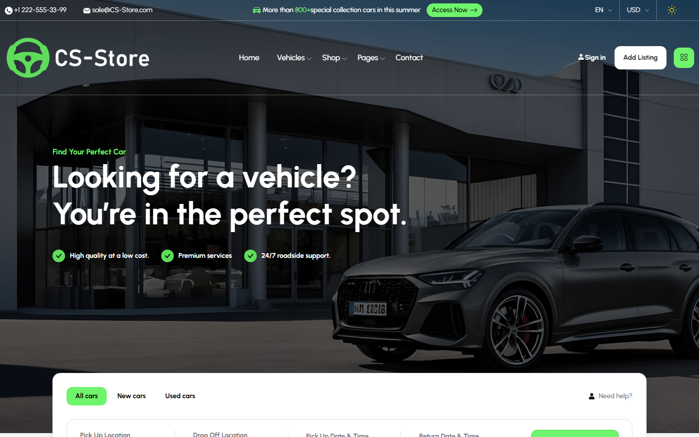
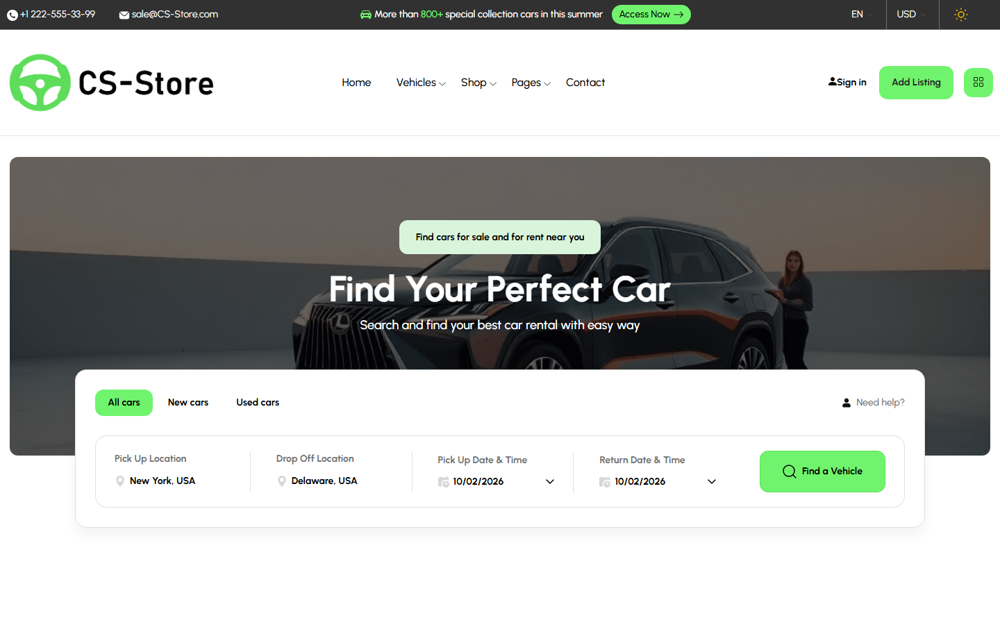
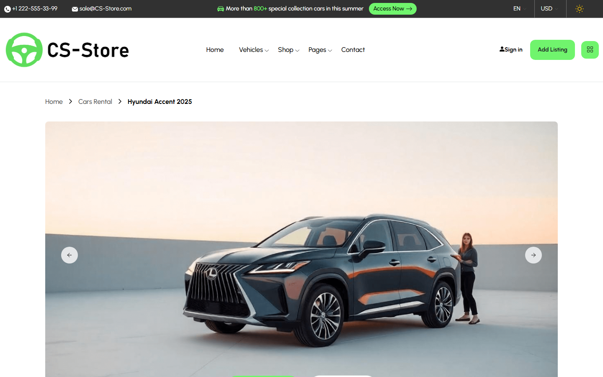
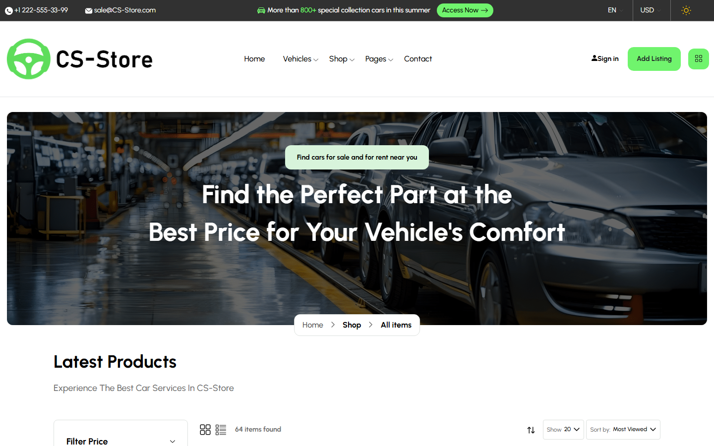
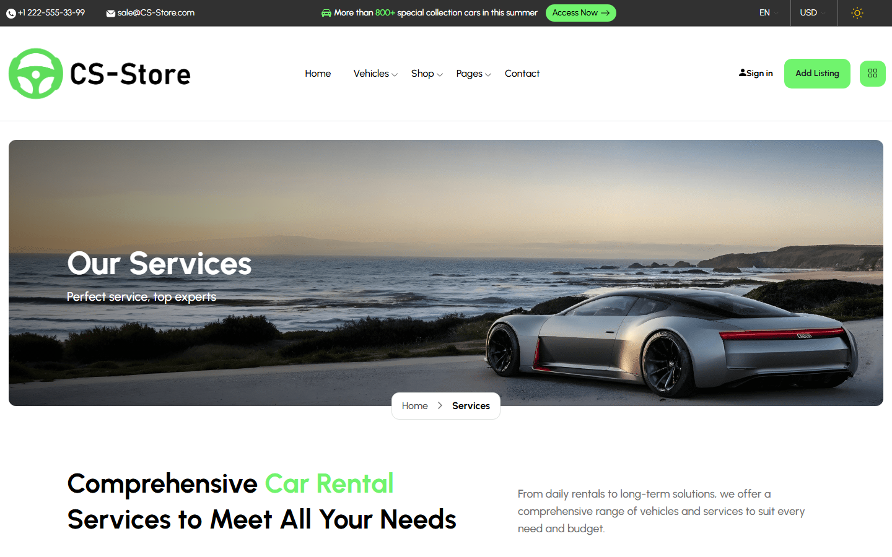
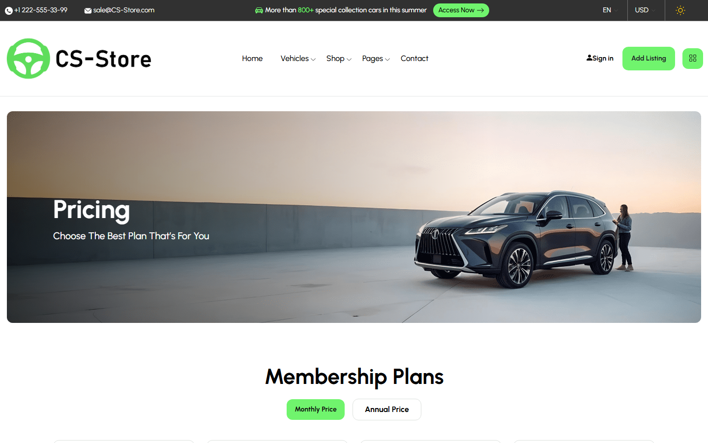
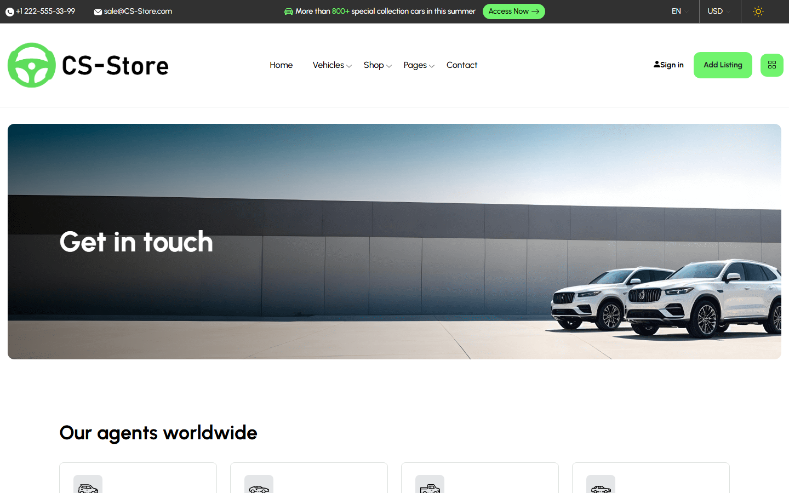
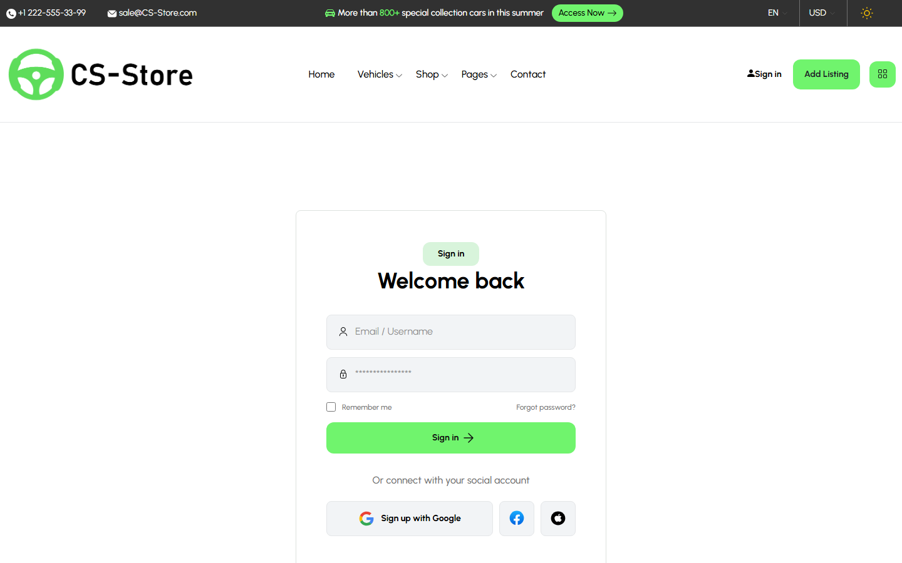

# CS-Store — Car Rental & Auto Parts Web App

CS-Store is a responsive car rental and car marketplace website built with **Next.js 14 (App Router)**, **React 18**, **TypeScript** and **Bootstrap 5**. It was developed as my graduation project.

Users can browse and filter a catalogue of cars, view detailed car pages, shop for car parts and accessories, compare membership plans, and reach the business through contact and service pages.



---

## Table of Contents

- [Features](#features)
- [Tech Stack](#tech-stack)
- [Screenshots](#screenshots)
- [Getting Started](#getting-started)
- [Available Scripts](#available-scripts)
- [Project Structure](#project-structure)
- [Pages & Routes](#pages--routes)
- [Car Data & Filtering](#car-data--filtering)
- [Author](#author)

---

## Features

- **Home page** with hero banner, quick vehicle search (pick-up / drop-off location and dates), categories, featured cars, services, testimonials and app download sections.
- **Car listing** with filters by car type, fuel type, amenities, location, price range and rating, plus sorting (name, price, rating) and pagination.
- **Car details** page with an image gallery slider, specifications and booking information.
- **Shop** for car parts and accessories, with a product list and a product details page.
- **Pricing** page with monthly / annual membership plans toggle.
- **Services, About us, Contact, Terms** informational pages.
- **Login & Register** pages.
- **Light / dark theme switch**.
- Animated counters, carousels/sliders, video modal and a back-to-top button.
- Custom **404 / Not Found** page.
- Fully **responsive** layout with desktop and mobile menus.

## Tech Stack

| Category       | Technology |
| -------------- | ---------- |
| Framework      | [Next.js 14](https://nextjs.org/) (App Router) |
| UI library     | [React 18](https://react.dev/) |
| Language       | [TypeScript 5](https://www.typescriptlang.org/) |
| Styling        | Bootstrap 5, custom CSS, Urbanist font (`next/font/google`) |
| UI components  | react-bootstrap |
| Sliders        | Swiper, react-slick, react-fast-marquee |
| Other          | react-datepicker, react-odometerjs, react-modal-video, react-perfect-scrollbar, wowjs |
| Linting        | ESLint (`eslint-config-next`) |

## Screenshots

| Home | Cars List |
| :--: | :--: |
|  |  |

| Car Details | Shop |
| :--: | :--: |
|  |  |

| Services | Pricing |
| :--: | :--: |
|  |  |

| Contact | Login |
| :--: | :--: |
|  |  |

## Getting Started

### Prerequisites

- [Node.js](https://nodejs.org/) **18.17 or later** (required by Next.js 14)
- npm (comes with Node.js)
- Git

### Installation

1. **Clone the repository**

   ```bash
   git clone https://github.com/omarMohammedbenzo/Graduation-project.git
   cd Graduation-project
   ```

2. **Install dependencies**

   ```bash
   npm install
   ```

3. **Run the development server**

   ```bash
   npm run dev
   ```

4. Open [http://localhost:3000](http://localhost:3000) in your browser.

### Production build

```bash
npm run build
npm start
```

The production server runs on [http://localhost:3000](http://localhost:3000) by default.

> No environment variables or database are required — all car data is loaded from a local JSON file.

## Available Scripts

| Command         | Description |
| --------------- | ----------- |
| `npm run dev`   | Start the development server with hot reload |
| `npm run build` | Create an optimized production build |
| `npm start`     | Start the production server (run `build` first) |
| `npm run lint`  | Run ESLint on the project |

## Project Structure

```
.
├── app/                    # Next.js App Router pages
│   ├── layout.tsx          # Root layout (fonts, global CSS, metadata)
│   ├── page.tsx            # Home page
│   ├── not-found.tsx       # Not-found handler
│   ├── 404/                # Custom 404 page
│   ├── about-us/
│   ├── cars-list/
│   ├── cars-details/
│   ├── shop-list/
│   ├── shop-details/
│   ├── services/
│   ├── pricing/
│   ├── contact/
│   ├── login/
│   ├── register/
│   └── term/
├── components/
│   ├── layout/             # Layout wrapper, headers, footers, menus, breadcrumb
│   ├── sections/           # Page sections (Hero, Categories, CTA, Testimonials, ...)
│   ├── elements/           # Reusable UI (car cards, date picker, theme switch, ...)
│   └── Filter/             # Car filter widgets (type, fuel, price, rating, ...)
├── util/
│   ├── cars.json           # Car catalogue data
│   ├── useCarFilter.ts     # Custom hook for filtering, sorting and pagination
│   └── swiperOptions.tsx   # Shared Swiper slider configurations
├── public/assets/          # CSS, fonts and images
├── screenshots/            # Screenshots used in this README
├── next.config.mjs
├── tsconfig.json
└── package.json
```

## Pages & Routes

| Route           | Description |
| --------------- | ----------- |
| `/`             | Home page |
| `/cars-list`    | Car catalogue with filters, sorting and pagination |
| `/cars-details` | Single car details |
| `/shop-list`    | Car parts & accessories shop |
| `/shop-details` | Single product details |
| `/services`     | Services offered |
| `/pricing`      | Membership plans (monthly / annual) |
| `/about-us`     | About the company |
| `/contact`      | Contact form, offices and location |
| `/login`        | Sign in |
| `/register`     | Create an account |
| `/term`         | Terms & conditions |
| `/404`          | Custom 404 page |

## Car Data & Filtering

Car data lives in [`util/cars.json`](util/cars.json). Each car has the following shape:

```json
{
  "id": 1,
  "price": 100,
  "duration": "7",
  "carType": "Sedans",
  "amenities": "Leather upholstery",
  "rating": "4.5",
  "fuelType": "Plug-in Hybrid (PHEV)",
  "location": "Machu Picchu",
  "image": "car-1.png",
  "name": "GMC Sierra 2500HD Denali"
}
```

The [`useCarFilter`](util/useCarFilter.ts) hook takes this list and provides:

- filtering by name, car type, fuel type, amenities, location, price range and rating
- sorting by name, price or rating
- pagination with a configurable number of items per page

To add a new car, add an entry to `cars.json` and place its image in `public/assets/imgs/cars-listing/cars-listing-6/`.

## Author

**Omar Mohammed** — Graduation Project

- GitHub: [@omarMohammedbenzo](https://github.com/omarMohammedbenzo)
